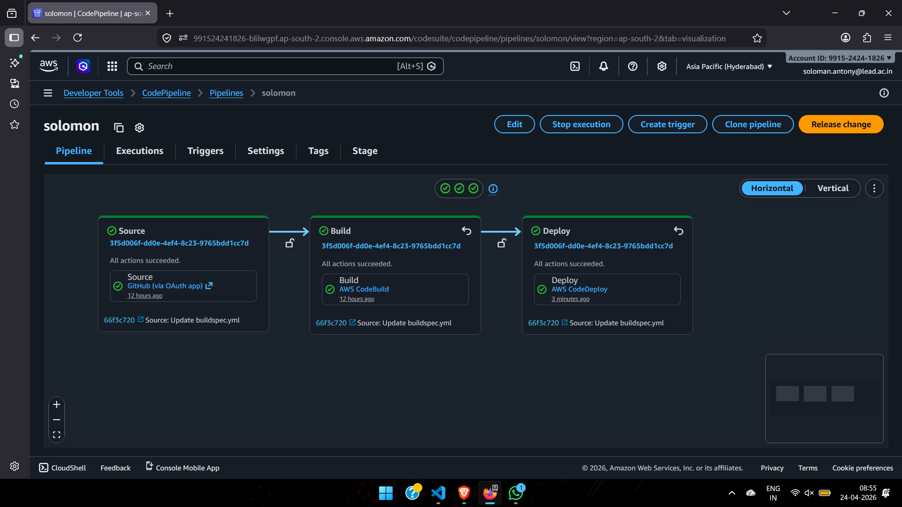
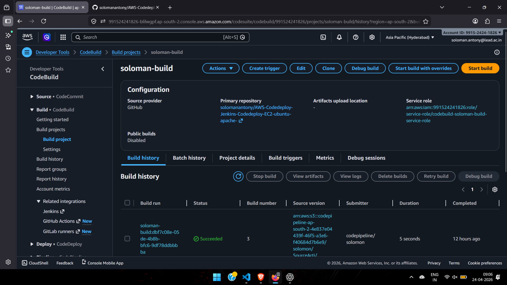
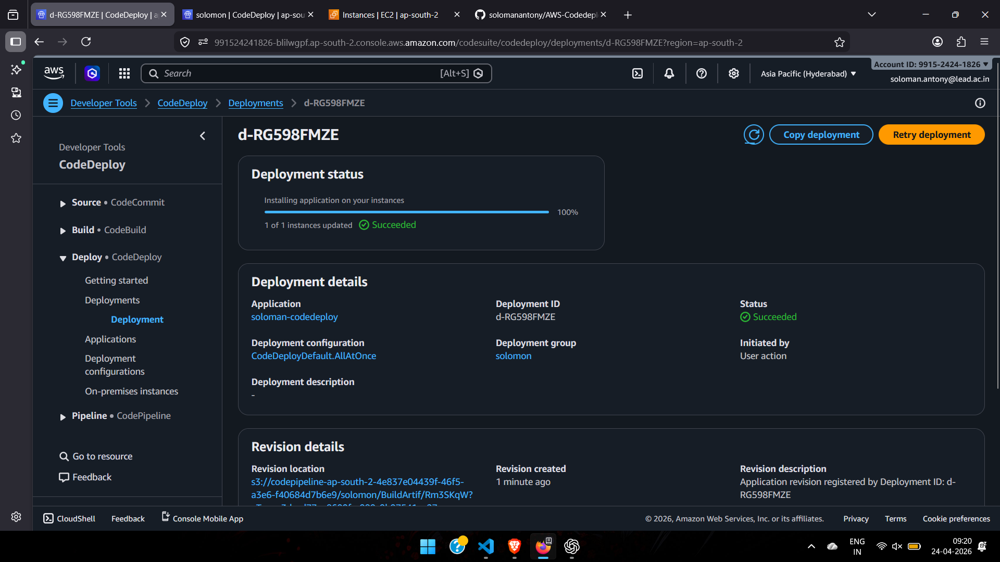
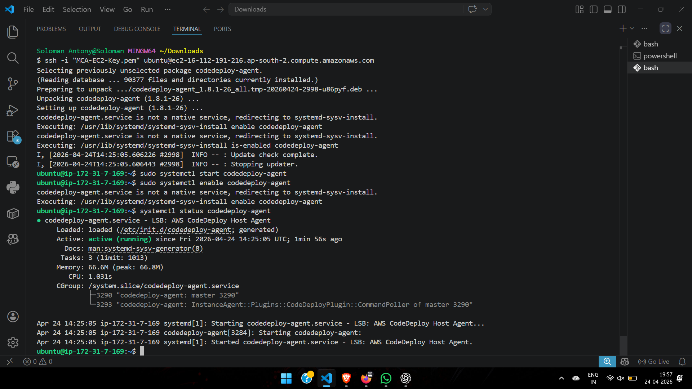
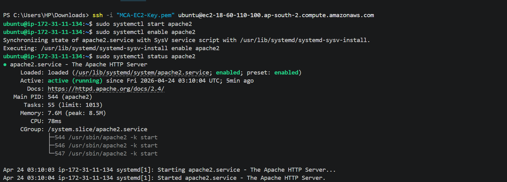
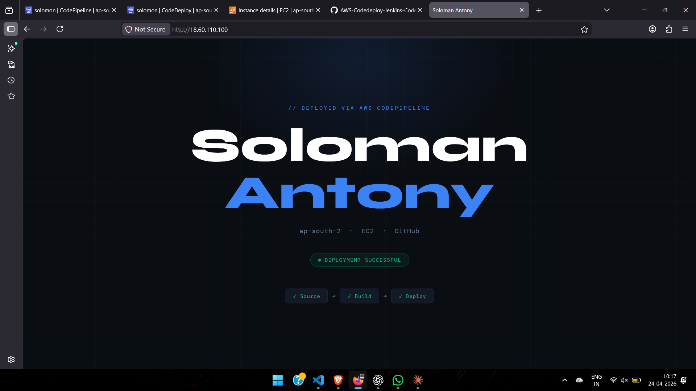

# 🚀 AWS CI/CD Pipeline using CodePipeline, CodeBuild & CodeDeploy

## 📌 Project Overview

This project demonstrates the implementation of a complete **CI/CD pipeline on AWS** to automate the deployment of a static web application to an EC2 instance.

The pipeline integrates multiple AWS services to ensure that any changes pushed to the GitHub repository are automatically built and deployed without manual intervention.

---

## 🔁 Architecture

```text
GitHub → CodePipeline → CodeBuild → CodeDeploy → EC2 (Apache)
```

---

## 🏗️ AWS Services Used

* **AWS CodePipeline** – Orchestrates the entire CI/CD workflow
* **AWS CodeBuild** – Builds and packages the application
* **AWS CodeDeploy** – Deploys the application to EC2
* **Amazon EC2 (Ubuntu)** – Hosts the web application
* **Amazon S3** – Stores build artifacts
* **AWS IAM** – Manages roles and permissions

---

## 📂 Project Structure

```text
.
├── app/
│   └── index.html
├── appspec.yml
├── buildspec.yml
├── screenshots/
└── README.md
```

---

## ⚙️ Configuration Files

### 🔹 buildspec.yml

```yaml
version: 0.2

phases:
  install:
    commands:
      - echo "Installing dependencies"

  build:
    commands:
      - echo "Build started"

artifacts:
  files:
    - '**/*'
```

---

### 🔹 appspec.yml

```yaml
version: 0.0
os: linux

files:
  - source: app/
    destination: /var/www/html
    overwrite: yes
```

This configuration ensures that the application files inside the `app/` directory are copied to the Apache web root directory on the EC2 instance.

---

## 🖥️ EC2 Configuration

### Install Apache Web Server

```bash
sudo apt update
sudo apt install apache2 -y
```

### Install CodeDeploy Agent

```bash
cd /tmp
wget https://aws-codedeploy-ap-south-2.s3.ap-south-2.amazonaws.com/latest/codedeploy-agent_all.deb
sudo dpkg -i codedeploy-agent_all.deb
```

### Start Required Services

```bash
sudo systemctl start apache2
sudo systemctl enable apache2

sudo systemctl start codedeploy-agent
sudo systemctl enable codedeploy-agent
```

---

## 🔐 IAM Roles Used

### EC2 Instance Role

* `AmazonEC2RoleforAWSCodeDeploy`
* Allows EC2 to receive deployment artifacts from CodeDeploy

### CodeDeploy Service Role

* `AWSCodeDeployRole`
* Allows CodeDeploy to manage deployments on EC2 instances

### CodeBuild Role

* Allows access to S3 and source repository

### CodePipeline Role

* Orchestrates interactions between all services

---

## 🚀 Deployment Workflow

1. Code is pushed to GitHub
2. CodePipeline automatically detects changes
3. CodeBuild processes the application
4. Artifacts are stored in S3
5. CodeDeploy deploys files to EC2
6. Apache serves the updated application

---

## 📸 Screenshots

### 🔹 Pipeline Execution



---

### 🔹 Build Stage



---

### 🔹 Deployment Status



---

### 🔹 CodeDeploy Agent Running



---

### 🔹 Apache Service Running



---

### 🔹 Application Output



---

## ⚠️ Issues Faced & Resolution

### Issue: Apache Default Page Displayed

* The default Apache page was shown instead of the deployed application.

### Resolution:

* Updated `appspec.yml` to correctly copy application files
* Added `overwrite: yes` to replace existing files
* Ensured correct file structure (`app/` directory)

---

### Issue: Deployment Not Reflecting Changes

* Changes were not visible after deployment.

### Resolution:

* Verified file paths in `appspec.yml`
* Confirmed CodeDeploy agent was running
* Restarted Apache service when required

---

## 🎯 Key Learnings

* Implementation of a complete CI/CD pipeline using AWS services
* Integration of CodePipeline, CodeBuild, and CodeDeploy
* Understanding IAM roles and permissions
* Debugging real-world deployment issues
* Managing application deployment using configuration files

---

## 👨‍💻 Author

**Soloman Antony**
